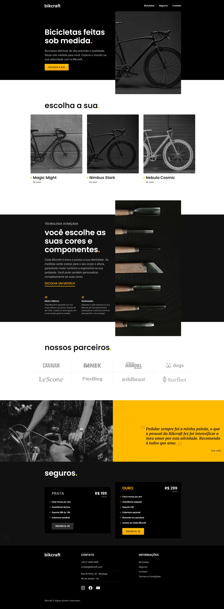
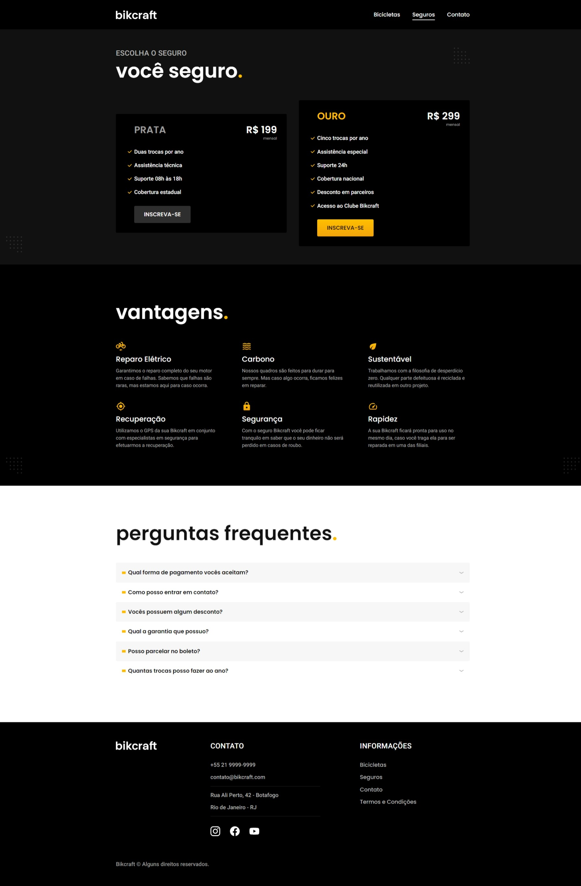
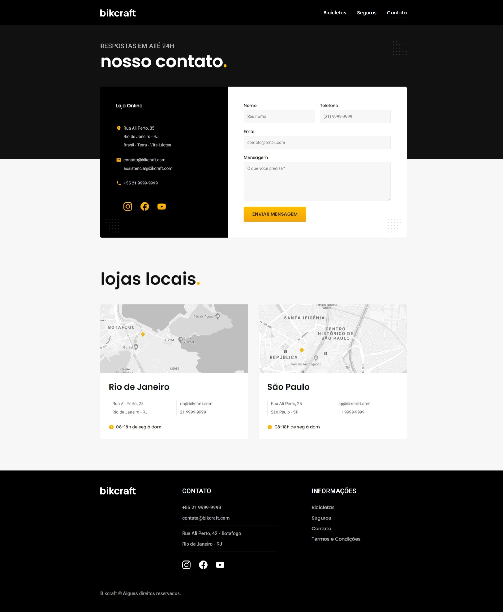

<h1 align= "center">

</h1>

## 🚴🏽‍♀️Sobre:
<p>Neste projeto fictício eu uso CSS Flexbox e Grid Layout para construir um site responsivo de bicicletas elétricas.</p>
<br>
<br><br><br>
<br><br><br>
<br><br><br>

```bash
#Clone the project
$ git clone https://github.com/LairaCastro/bikcraft.git
```
